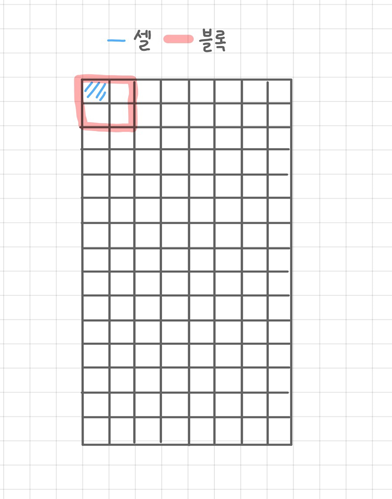

# 13. 객체 검출

> 출처 : [OpenCV 4로 배우는 컴퓨터 비전과 머신러닝](https://www.aladin.co.kr/shop/wproduct.aspx?ItemId=187822936)

## 13.1 템플릿 매칭

* 작은 크기의 부분 영상 위치를 찾아내고 싶은 경우 사용
* 입력 영상 전체 영역에 대해 오른쪽으로 이동하면서 가장 비슷한 위치를 찾아내는 방
* 입력 영상과 템플릿 영상\(찾아내고 싶은 영역 영상\)의 유사도 또는 비유사도를 계산함
* 유사도를 기준으로 결과 출력 영상을 그레이 스케일로 나타낼 경우 가장 밝은 부분이 가장 유사한 부분

<table>
  <thead>
    <tr>
      <th style="text-align:left">void matchTemplate(InputArray image, InputArray temp1, OutputArray result,
        int method, InputArray mask = noArray());</th>
    </tr>
  </thead>
  <tbody>
    <tr>
      <td style="text-align:left">
        <ul>
          <li>image : &#xC785;&#xB825; &#xC601;&#xC0C1; (8 or 32 &#xBE44;&#xD2B8;)</li>
          <li>temp1 : &#xD15C;&#xD50C;&#xB9BF; &#xC601;&#xC0C1;(&#xCC3E;&#xC544;&#xB0B4;&#xACE0;
            &#xC2F6;&#xC740; &#xC601;&#xC5ED; &#xC601;&#xC0C1;),image&#xBCF4;&#xB2E4;
            &#xAC19;&#xAC70;&#xB098; &#xC791;&#xC544;&#xC57C;&#xD558;&#xBA70; &#xD0C0;&#xC785;&#xC774;
            &#xAC19;&#xC544;&#xC57C;&#xD568;</li>
          <li>result : &#xBE44;&#xAD50; &#xACB0;&#xACFC; &#xC800;&#xC7A5; &#xD589;&#xB82C;
            ( CV_32FC1 )</li>
          <li>method : &#xD15C;&#xD50C;&#xB9BF; &#xB9E4;&#xCE6D; &#xBE44;&#xAD50; &#xBC29;&#xBC95;</li>
          <li>mask : &#xD15C;&#xD50C;&#xB9BF;&#xC758; &#xB9C8;&#xC2A4;&#xD06C; &#xC601;&#xC0C1;
            (temp1&#xACFC; &#xAC19;&#xC740; &#xD06C;&#xAE30;, &#xAC19;&#xC740; &#xD0C0;&#xC785;,
            TM_<em>SQDIFF&#xC640; TM_CCORR_NORMED&#xC5D0;&#xC11C;&#xB9CC; &#xC9C0;&#xC6D0;)</em>
          </li>
        </ul>
      </td>
    </tr>
  </tbody>
</table>

* result 행렬의 크기는 \(image.width - temp1.width +1\) X \(image.height - temp1.height +1\)로 결정됨
* method 인자는 TemplateMatchModes 열거형 상수 중 하나 지정
  * TM\_SQDIFF
  * TM\_SQDIFF\_NORMED
  * TM\_CCORR
  * TM\_CCORR\_NORMED
  * TM\_CCOEFF
  * TM\_CCOEFF\_NORMED

<table>
  <thead>
    <tr>
      <th style="text-align:left">TemplateMatchModes &#xC5F4;&#xAC70;&#xD615; &#xC0C1;&#xC218;</th>
      <th style="text-align:left">&#xC124;</th>
    </tr>
  </thead>
  <tbody>
    <tr>
      <td style="text-align:left">TM_SQDIFF</td>
      <td style="text-align:left">
        
&#xC81C;&#xACF1;&#xCC28; &#xB9E4;&#xCE6D; &#xBC29;&#xBC95;

        
&#xCD5C;&#xC19F;&#xAC12; &#xC704;&#xCE58;&#xB97C; &#xAC00;&#xC7A5; &#xB9E4;&#xCE6D;&#xC774;
          &#xC798; &#xB41C; &#xC704;&#xCE58;&#xB85C; &#xC120;&#xD0DD;

      </td>
    </tr>
    <tr>
      <td style="text-align:left">TM_SQDIFF_NORMED</td>
      <td style="text-align:left">
        
&#xC815;&#xADDC;&#xD654;&#xB41C; &#xC81C;&#xACF1;&#xCC28; &#xB9E4;&#xCE6D;
          &#xBC29;&#xBC95;

        
&#xCD5C;&#xC19F;&#xAC12; &#xC704;&#xCE58;&#xB97C; &#xAC00;&#xC7A5; &#xB9E4;&#xCE6D;&#xC774;
          &#xC798; &#xB41C; &#xC704;&#xCE58;&#xB85C; &#xC120;&#xD0DD;

      </td>
    </tr>
    <tr>
      <td style="text-align:left">TM_CCORR</td>
      <td style="text-align:left">
        
&#xC0C1;&#xAD00;&#xAD00;&#xACC4; &#xB9E4;&#xCE6D; &#xBC29;&#xBC95;

        
&#xCD5C;&#xB313;&#xAC12; &#xC704;&#xCE58;&#xB97C; &#xAC00;&#xC7A5; &#xB9E4;&#xCE6D;&#xC774;
          &#xC798;&#xB41C; &#xC704;&#xCE58;&#xB85C; &#xC120;&#xD0DD;

      </td>
    </tr>
    <tr>
      <td style="text-align:left">TM_CCORR_NORMED</td>
      <td style="text-align:left">
        
&#xC815;&#xADDC;&#xD654;&#xB41C; &#xC0C1;&#xAD00;&#xAD00;&#xACC4; &#xB9E4;&#xCE6D;
          &#xBC29;&#xBC95;

        
&#xCD5C;&#xB313;&#xAC12; &#xC704;&#xCE58;&#xB97C; &#xAC00;&#xC7A5; &#xB9E4;&#xCE6D;&#xC774;
          &#xC798;&#xB41C; &#xC704;&#xCE58;&#xB85C; &#xC120;&#xD0DD;

      </td>
    </tr>
    <tr>
      <td style="text-align:left">TM_CCOEFF</td>
      <td style="text-align:left">
        
&#xC0C1;&#xAD00;&#xACC4;&#xC218; &#xB9E4;&#xCE6D; &#xBC29;&#xBC95;

        
&#xCD5C;&#xB313;&#xAC12; &#xC704;&#xCE58;&#xB97C; &#xAC00;&#xC7A5; &#xB9E4;&#xCE6D;&#xC774;
          &#xC798;&#xB41C; &#xC704;&#xCE58;&#xB85C; &#xC120;&#xD0DD;

      </td>
    </tr>
    <tr>
      <td style="text-align:left">TM_CCOEFF_NORMED</td>
      <td style="text-align:left">
        
&#xC815;&#xADDC;&#xD654;&#xB41C; &#xC0C1;&#xAD00;&#xACC4;&#xC218; &#xB9E4;&#xCE6D;
          &#xBC29;&#xBC95;

        
&#xC88B;&#xC740; &#xACB0;&#xACFC;&#xAC12; &#xC81C;&#xACF5;/&#xC5F0;&#xC0B0;&#xB7C9;&#xC774;
          &#xB9CE;&#xC74C;

      </td>
    </tr>
  </tbody>
</table>

## 13.2 캐스케이드 분류기와 얼굴 검출

* 2001년에 비올라와 존스가 발표한 부스팅기반 알고리즘을 기반으로 만들어짐
* 다양한 객체 검출 가능하지만 특히 얼굴 검출에서 속도와 정확도를 인정받음

**비올라-존스 얼굴 검출 알고리즘**

1. 영상을 24X24 크기로 정규화
2. 유사-하르 필터 집합\(흑백 사각형이 서로 붙어 있는 형태로 구성된 필터\)으로부터 특정 정보 추출하여 얼굴 여부 판별
3. 흰색 영역 픽셀 값은 모두 더하고 검은색 영역 픽셀 값은 모두 빼서 하나의 특징 값을 얻음

* 24X24 크기에서 유사-하르 필터를 약 18만 개 생성 가능하기에 시간이 오래 걸린다는 것이 단점이였지만 **에이다부스트 알고리즘**과 **적분영상**을 이용하여 문제 해결
* 대부분의 영상에 얼굴이 많지 않다는 점에 초점을 맞추어 **케스케이드 구조**라는 새로운 방식 도입

**케스케이드 구조**

1. 에이다부스트 알고리즘을 통해 선별한 6000개의 얼굴 검출에 유용한 필터를 사용함
2. 가장 유용한 필터를 사용하여 얼굴이 아니라고 판단시 다시 검사를 진행하지 않음
3. 걸러진 영역들은 좀 더 많은 필터를 사용하여 다시 얼굴인지 아닌지를 판단함

* OpenCV는 이 구조를 이용하여 CascadeClassifier 클래스를 제공
* OpenCV는 미리 훈련된 얼굴,눈 검출 등을 위한 XML 파일을 제공함
  * %OPENCV\_DIR%\etc\haarcascades 폴더에 찾을 수 있음

<table>
  <thead>
    <tr>
      <th style="text-align:left">XML</th>
      <th style="text-align:left">&#xAC80;&#xCD9C; &#xB300;&#xC0C1;</th>
    </tr>
  </thead>
  <tbody>
    <tr>
      <td style="text-align:left">
        
haarcascade_frontalface_default.xml

        
haarcascade_frontalface_alt.xml

        
haarcascade_frontalface_alt2.xml

        
haarcascade_frontalface_alt_tree.xml

      </td>
      <td style="text-align:left">&#xC815;&#xBA74; &#xC5BC;&#xAD74; &#xAC80;&#xCD9C;</td>
    </tr>
    <tr>
      <td style="text-align:left">haarcascade_profileface.xml</td>
      <td style="text-align:left">&#xCE21;&#xBA74; &#xC5BC;&#xAD74; &#xAC80;&#xCD9C;</td>
    </tr>
    <tr>
      <td style="text-align:left">haarcascade_smile.xml</td>
      <td style="text-align:left">&#xC6C3;&#xC74C; &#xAC80;&#xCD9C;</td>
    </tr>
    <tr>
      <td style="text-align:left">
        
haarcascade_eye.xml

        
haarcascade_eye_free_eyeglasses.xml

        
haarcascade_lefteye_2splits.xml

        
haarcascade_righteye_2splits.xml

      </td>
      <td style="text-align:left">&#xB208; &#xAC80;&#xCD9C;</td>
    </tr>
    <tr>
      <td style="text-align:left">
        
haarcascade_frontalcatface.xml

        
haarcascade_frontalcatface_extended.xml

      </td>
      <td style="text-align:left">&#xACE0;&#xC591;&#xC774; &#xC5BC;&#xAD74; &#xAC80;&#xCD9C;</td>
    </tr>
    <tr>
      <td style="text-align:left">haarcascade_fullbody.xml</td>
      <td style="text-align:left">&#xC0AC;&#xB78C;&#xC758; &#xC804;&#xC2E0; &#xAC80;&#xCD9C;</td>
    </tr>
    <tr>
      <td style="text-align:left">haarcascade_upperbody.xml</td>
      <td style="text-align:left">&#xC0AC;&#xB78C;&#xC758; &#xC0C1;&#xBC18;&#xC2E0; &#xAC80;</td>
    </tr>
    <tr>
      <td style="text-align:left">haarcascade_lowerbody.xml</td>
      <td style="text-align:left">&#xC0AC;&#xB78C;&#xC758; &#xD558;&#xBC18;&#xC2E0; &#xAC80;&#xCD9C;</td>
    </tr>
    <tr>
      <td style="text-align:left">
        
haarcascade_russian_plate_number.xml

        
haarcascade_licence_plate_rus_16stages.xml

      </td>
      <td style="text-align:left">&#xB7EC;&#xC2DC;&#xC544; &#xC790;&#xB3D9;&#xCC28; &#xBC88;&#xD638;&#xD310;
        &#xAC80;&#xCD9C;</td>
    </tr>
  </tbody>
</table>

* 팁 : 분류기 파일이 정상적으로 불러왔는지 empty\(\) 함수를 이용하여 체크
* detectMultiScale\(\) 멤버 함수를 이용하여 객체 검출 실행
  * 입력 영상이 3채널 컬러영상이면 그레이스케일 형식으로 변환하여 객체 검출
* 4.0.0 버전부터는 분류기 학습 프로그램 제공 X
  * 최근 딥러닝에 의한 객체 검출 선호

## 13.3 HOG 알고리즘과 보행자 검출

* 2005년 다랄과 트릭스가 발표함
* HOG\(Histograms of Oriented Gradients\)
* 사람이 서 있는 영상에서 그래디언트의 크기와 방향 값을 이용하여 서 있는 형태의 특징 벡터를 정의하고 서포트 벡터 머신 알고리즘을 통해 보행자 위치 검출

**HOG 그래디언트 값 추출**

1. 64x128 크기의 영상에서그래디언트를 크기와 방향 성분\(0º~180º\)으로 계산
2. 8x8 크기 단위로 분할하고 1칸을 셀이라 부름 \(셀은 8x16개 생성\)
3. 한 셀 안에 방향 성분을 20º 단위로 구분하여 9개의 빈으로 구성된 방향 히스토그램을 만듬
4. 인접한 네 개의 셀을 묶어서 블록이라 부르고 한 블록 안에는 9x4=36개의 실수 값이 존재
5. 추출할 때 한 블록이 아닌 한 셀씩 움직이며 추출하기 때문에 7x15=105개의 블록이 추출
6. 결국 105x36=3780개의 실수 값이 도출됨

* SVM 알고리즘 사용하여 보행자인지 아닌지 구분
  * SVM은 두 개의 클래스를 효과적으로 분리하는 머신 러닝 알고리즘
* HOGDescriptor::getDefaultPeopleDetector\(\) : 미리 계산된 보행자 검출을 위한 HOG 기술자 정보를 반환하는 함수
* HOGDescriptor::setSVMDetector\(\) : SVM 분류기 계수\(getDefaultPeopleDetector\(\)가 반환하는 계수\)를 이 함수를 통해 등록

<table>
  <thead>
    <tr>
      <th style="text-align:left">
        
virtual void HOGDescriptor::detectMultiScale(InputArray img, std::vector&lt;Rect&gt;&amp;
          foundLocations, std::vector&lt;double&gt;&amp; foundWeights, double hitThreshold
          =0, Size winStride = Size(), Size padding = Size(), double scale = 1.05,
          double finalThreshold = 2.0, bool useMeanshiftGrouping = false) const;

        

        
virtual void HOGDescriptor::detectMultiScale(InputArray img, std::vector&lt;Rect&gt;&amp;
          foundLocations, double hitThreshold = 0, Size winStride = Size(), Size
          padding = Size(), double scale = 1.05, double finalThreshold = 2.0, bool
          useMeanshiftGrouping = false) const;

      </th>
    </tr>
  </thead>
  <tbody>
    <tr>
      <td style="text-align:left">
        <ul>
          <li>img : &#xC785;&#xB825; &#xC601;&#xC0C1; (CV_8UC1 or CV_8UC3)</li>
          <li>foundLocations : &#xC0AC;&#xAC01;&#xD615; &#xC601;&#xC5ED; &#xC815;&#xBCF4;</li>
          <li>foundWeights : &#xC0AC;&#xAC01;&#xD615; &#xC2E0;&#xB8B0;&#xB3C4;</li>
          <li>hitThreshold : &#xD2B9;&#xC9D5; &#xBCA1;&#xD130;&#xC640; SVM &#xBD84;&#xB958;
            &#xD3C9;&#xBA74;&#xAE4C;&#xC9C0;&#xC758; &#xAC70;&#xB9AC;&#xC5D0; &#xB300;&#xD55C;
            &#xC784;&#xACC4;&#xAC12;</li>
          <li>winStride : &#xC140; &#xC708;&#xB3C4;&#xC6B0; &#xC774;&#xB3D9; &#xD06C;&#xAE30;
            (Size() &#xC9C0;&#xC815; &#xC2DC; &#xC140; &#xD06C;&#xAE30;&#xC640; &#xB3D9;&#xC77C;)</li>
          <li>padding : &#xD328;&#xB529; &#xD06C;&#xAE30;</li>
          <li>scale : &#xC708;&#xB3C4;&#xC6B0; &#xD06C;&#xAE30; &#xD655;&#xB300; &#xBE44;&#xC728;</li>
          <li>finalThreshold : &#xAC80;&#xCD9C; &#xACB0;&#xC815;&#xC744; &#xC704;&#xD55C;
            &#xC784;&#xACC4;&#xAC12;</li>
          <li>useMeanshiftGrouping : &#xACB9;&#xCCD0;&#xC9C4; &#xAC80;&#xC0C9; &#xC708;&#xB3C4;&#xC6B0;
            &#xD569;&#xCE58;&#xB294; &#xBC29;&#xBC95; &#xC9C0;&#xC815;</li>
        </ul>
      </td>
    </tr>
  </tbody>
</table>

* HOGDescriptor::detectMultiScale\(\) : 입력 영상에서 다양한 사각형 영역을 검출하고 foundLocations에 저장\(2가지 함수 중 한 가지느 사각형 영역에 대한 신뢰도를 함께 반환함\)

## 13.4 QR 코드 검출

* QR 코드에는 숫자, 영문자, 8비트 문자, 한자 등의 정보를 저장 가능

**검출 방법**

1. 세 모서리에 포함된 흑백 정사각형 패턴을 찾아서 QR 코드 영역을 검출
2. 검출된 사각형 내에 있는 흑백 격자 무늬를 해석하여 문자열 추출

* 위의 방법은 복잡하고 정교한 방법이 필요하므로 OpenCV에서는 QRCodeDetector 클래스를 제공함
* QR 코드 영역만을 검출하기 위해서는 detect\(\) 함수 사용

<table>
  <thead>
    <tr>
      <th style="text-align:left">bool QRCodeDetector::detect(InputArray img, OutputArray points) const;</th>
    </tr>
  </thead>
  <tbody>
    <tr>
      <td style="text-align:left">
        <ul>
          <li>img : &#xC785;&#xB825; &#xC601;&#xC0C1;(CV_8U or CV_8UC3)</li>
          <li>points : QR &#xCF54;&#xB4DC;&#xB97C; &#xAC10;&#xC2F8;&#xB294; &#xC0AC;&#xAC01;&#xD615;&#xC758;
            4 &#xAF2D;&#xC9C0;&#xC810; &#xC88C;&#xD45C;</li>
          <li>&#xBC18;&#xD658;&#xAC12; bool : &#xAC80;&#xCD9C;&#xC2DC; true, &#xAC80;&#xCD9C;&#xD558;&#xC9C0;
            &#xBABB;&#xD588;&#xC744; &#xB54C; false</li>
        </ul>
      </td>
    </tr>
  </tbody>
</table>

* QR 코드에 저장된 문자열 추출하기 위해서 decode\(\) 함수 사용

<table>
  <thead>
    <tr>
      <th style="text-align:left">std::string QRCodeDetector::decode(InputArray img, InputAttay points,
        OutputArray straight_qrcode = noArray());</th>
    </tr>
  </thead>
  <tbody>
    <tr>
      <td style="text-align:left">
        <ul>
          <li>img : &#xC785;&#xB825; &#xC601;&#xC0C1;</li>
          <li>points : QR &#xCF54;&#xB4DC;&#xB97C; &#xAC10;&#xC2F8;&#xB294; &#xC0AC;&#xAC01;&#xD615;&#xC758;
            4 &#xAF2D;&#xC9C0;&#xC810; &#xC88C;&#xD45C;</li>
          <li>straight_qrcode : &#xC815;&#xC0AC;&#xAC01;&#xD615; QR &#xCF54;&#xB4DC;
            &#xC601;&#xC0C1;(CV_8UC1)</li>
          <li>&#xBC18;&#xD658;&#xAC12; std::string : QR &#xCF54;&#xB4DC;&#xC5D0; &#xD3EC;&#xD568;&#xB41C;
            &#xBB38;&#xC790;&#xC5F4;</li>
        </ul>
      </td>
    </tr>
  </tbody>
</table>

* 두 가지를 동시에 하는 함수는 detectAndDecode\(\) 함수를 사용

<table>
  <thead>
    <tr>
      <th style="text-align:left">std::string QRCodeDetector::detectAndDecode(InputArray img, OutputArray
        points = noArray(), OutputArray straight_qrcode = noArray());</th>
    </tr>
  </thead>
  <tbody>
    <tr>
      <td style="text-align:left">
        <ul>
          <li>img : &#xC785;&#xB825; &#xC601;&#xC0C1;(CV_8U)</li>
          <li>points : QR &#xCF54;&#xB4DC;&#xB97C; &#xAC10;&#xC2F8;&#xB294; &#xC0AC;&#xAC01;&#xD615;&#xC758;
            4 &#xAF2D;&#xC9C0;&#xC810; &#xC88C;&#xD45C;</li>
          <li>straight_qrcode : &#xC815;&#xC0AC;&#xAC01;&#xD615; QR &#xCF54;&#xB4DC;
            &#xC601;&#xC0C1;(CV_8UC1)</li>
          <li>&#xBC18;&#xD658;&#xAC12; std::string : QR &#xCF54;&#xB4DC;&#xC5D0; &#xD3EC;&#xD568;&#xB41C;
            &#xBB38;&#xC790;&#xC5F4;</li>
        </ul>
      </td>
    </tr>
  </tbody>
</table>

