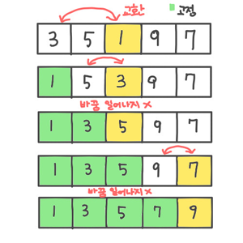

# 정렬

## 1. 선택 정렬

배열을 탐색해서 가장 작은 값을 보통 가장 고정되지 않은 왼쪽 값과 맞바꾼 후 바꿔진 왼쪽 자리를 고정하는 방식



```text
void selectSort(int list[], int n)
{
    int i,j,least,temp;
    for(int i=0;i<n-1;i++){
        least=i;
        for(int j=i+1;j<n;j++){
            if(list[j]<list[least])
                least = j;
        }
        //탐색이 끝난 후 고정되지 않은 왼쪽 값과 맞바꿈
        temp = list[i];
        list[i] = list[least];
        list[least] = temp;
    }
} 
```

* 시간 복잡도 : 

$$
n(n-1)/2 = O(n^2)
$$


